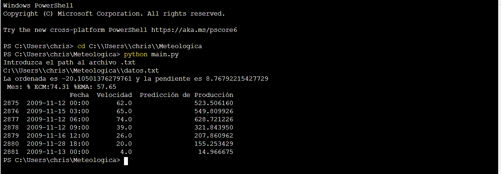

# regresi-n-deming
Implementación de una regresión de Deming en python

# Instalar

Este proyecto requiere **Python 3.6** y la instalación de las siguientes librerias:

- [numpy](http://www.numpy.org/)
- [pandas](http://pandas.pydata.org)
- [matplotlib](http://matplotlib.org/)
- [scikit-learn](http://scikit-learn.org/stable/)
- [scipy.odr](https://docs.scipy.org/doc/scipy/reference/odr.html)

## Descripción de archivos.

[Analisis](https://github.com/chrismartinezb/Game-of-thrones-analysis/blob/master/Final_Pipeline.ipynb): Jupyter notebook donde especifico todo el proceso, desde el analisis hasta el porque de la implementación.

[funciones_de_ayuda.py](https://github.com/chrismartinezb/Game-of-thrones-analysis/blob/master/GoT%20dialogue%20generator.ipynb): Se describe solo, son funciones que necesito para implementar una clase llamada Modelo_Deming en el siguiente archivo.

[deming.py](https://github.com/chrismartinezb/Game-of-thrones-analysis/tree/master/GoT): Archivo donde se encuentra mi implementacion de la regresion de Deming cuando delta = 1. 

[main.py](https://github.com/chrismartinezb/Game-of-thrones-analysis/tree/master/CSV): El modelo que se tiene que ejecutar para conseguir los resultados descritos en las instrucciones del ejercicio.

## Instrucciones.

