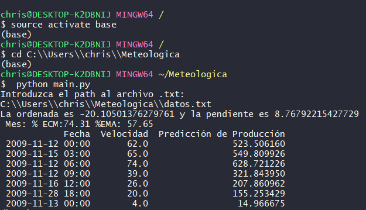

# regresi-n-deming
Implementación de una regresión de Deming en python

# Instalar

Este proyecto requiere **Python 3.6** y la instalación de las siguientes librerías:

- [numpy](http://www.numpy.org/)
- [pandas](http://pandas.pydata.org)
- [matplotlib](http://matplotlib.org/)
- [scikit-learn](http://scikit-learn.org/stable/)
- [scipy.odr](https://docs.scipy.org/doc/scipy/reference/odr.html)

## Descripción de archivos.

[Análisis](https://github.com/chrismartinezb/regresi-n-deming/blob/master/Analisis.ipynb): Jupyter notebook donde especifico todo el proceso, desde el análisis hasta el porque de la implementación.

[funciones_de_ayuda.py](https://github.com/chrismartinezb/regresi-n-deming/blob/master/funciones_de_ayuda.py): Se describe solo, son funciones que necesito para implementar una clase llamada Modelo_Deming en el siguiente archivo. Aquí pueden encontrar mi implementación de %ECM y %EMA.

[deming.py](https://github.com/chrismartinezb/regresi-n-deming/blob/master/deming.py): Archivo donde se encuentra mi implementación de la regresión de Deming cuando delta = 1. 

[main.py](https://github.com/chrismartinezb/regresi-n-deming/blob/master/main.py): El modelo que se tiene que ejecutar para conseguir los resultados descritos en las instrucciones del ejercicio.

## Instrucciones.

Una vez descargadas las librerías necesarias, accedemos al directorio donde se encuentran los archivos y ejecutamos main.py. Este nos va a pedir el path hacia el archivo .txt donde se encuentran los datos y predicciones en el formato especificado por el ejercicio. Despues de dar el path el programa nos regresara: 

Pendiente y ordenada.\

ECM Y EMA.\

Predicciones.\

